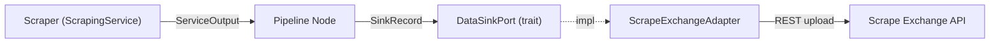

# Data Sinks (DataSinkPort)

A **data sink** is the outbound counterpart to a data source. Where scrapers
pull data in, sinks push structured records out — to an external platform,
database, message queue, or any other backend.

Stygian models this via the `DataSinkPort` trait, which provides a uniform
interface regardless of the underlying destination.

---

## Core Concepts

```
Scraper → Pipeline → DataSinkPort → Backend
```

Every sink implements three operations:

| Method | Description |
| --- | --- |
| `publish(record)` | Validate and send a `SinkRecord` to the backend |
| `validate(record)` | Check a record without side effects (preflight) |
| `health_check()` | Verify the backend is reachable |

---

## SinkRecord

A `SinkRecord` carries the payload and provenance information for a single
scraped item:

```rust
pub struct SinkRecord {
    /// JSON payload conforming to the named schema.
    pub data: serde_json::Value,
    /// Schema identifier (e.g. `"product-v1"`).
    pub schema_id: String,
    /// Canonical URL this record was scraped from.
    pub source_url: String,
    /// Arbitrary metadata (run ID, tenant, content-type, …).
    pub metadata: HashMap<String, String>,
}
```

Builder example:

```rust
use stygian_graph::ports::data_sink::SinkRecord;
use serde_json::json;

let record = SinkRecord::new(
    "product-v1",
    "https://shop.example.com/items/42",
    json!({ "sku": "ABC-42", "price": 9.99, "title": "Widget" }),
)
.with_meta("run_id", "run-2026-04-10")
.with_meta("tenant", "acme-corp");
```

---

## SinkReceipt

A successful `publish()` returns a `SinkReceipt`:

```rust
pub struct SinkReceipt {
    /// Platform-assigned ID for the published record.
    pub id: String,
    /// ISO 8601 timestamp of when the record was accepted.
    pub published_at: String,
    /// Human-readable sink platform name.
    pub platform: String,
}
```

---

## Available Sinks

| Adapter | Platform | Feature flag |
| --- | --- | --- |
| `ScrapeExchangeAdapter` | [Scrape Exchange](./scrape-exchange.md) | `scrape-exchange` |

---

## Implementing a Custom Sink

Any struct can implement `DataSinkPort`. The trait is object-safe and intended
for use via `Arc<dyn DataSinkPort>`.

```rust
use async_trait::async_trait;
use stygian_graph::ports::data_sink::{DataSinkPort, SinkRecord, SinkReceipt, DataSinkError};

struct MyFileSink {
    path: std::path::PathBuf,
}

#[async_trait]
impl DataSinkPort for MyFileSink {
    async fn publish(&self, record: &SinkRecord) -> Result<SinkReceipt, DataSinkError> {
        self.validate(record).await?;
        let json = serde_json::to_string(record)
            .map_err(|e| DataSinkError::PublishFailed(e.to_string()))?;
        tokio::fs::write(&self.path, json)
            .await
            .map_err(|e| DataSinkError::PublishFailed(e.to_string()))?;
        Ok(SinkReceipt {
            id: uuid::Uuid::new_v4().to_string(),
            published_at: chrono::Utc::now().to_rfc3339(),
            platform: "file".to_string(),
        })
    }

    async fn validate(&self, record: &SinkRecord) -> Result<(), DataSinkError> {
        if record.schema_id.is_empty() {
            return Err(DataSinkError::ValidationFailed("schema_id is required".into()));
        }
        Ok(())
    }

    async fn health_check(&self) -> Result<(), DataSinkError> {
        if self.path.parent().map_or(false, |p| p.exists()) {
            Ok(())
        } else {
            Err(DataSinkError::PublishFailed("output directory missing".into()))
        }
    }
}
```

---

## Error Handling

`DataSinkError` is `#[non_exhaustive]` — match on variants you care about and
use a fallback for future additions:

```rust
use stygian_graph::ports::data_sink::DataSinkError;

match sink.publish(&record).await {
    Ok(receipt) => println!("published: {}", receipt.id),
    Err(DataSinkError::ValidationFailed(msg)) => eprintln!("bad record: {msg}"),
    Err(DataSinkError::RateLimited(msg)) => {
        eprintln!("rate limited: {msg}");
        // back off and retry
    }
    Err(DataSinkError::Unauthorized(msg)) => eprintln!("auth error: {msg}"),
    Err(e) => eprintln!("sink error: {e}"),
}
```

---

## Architecture Diagram


