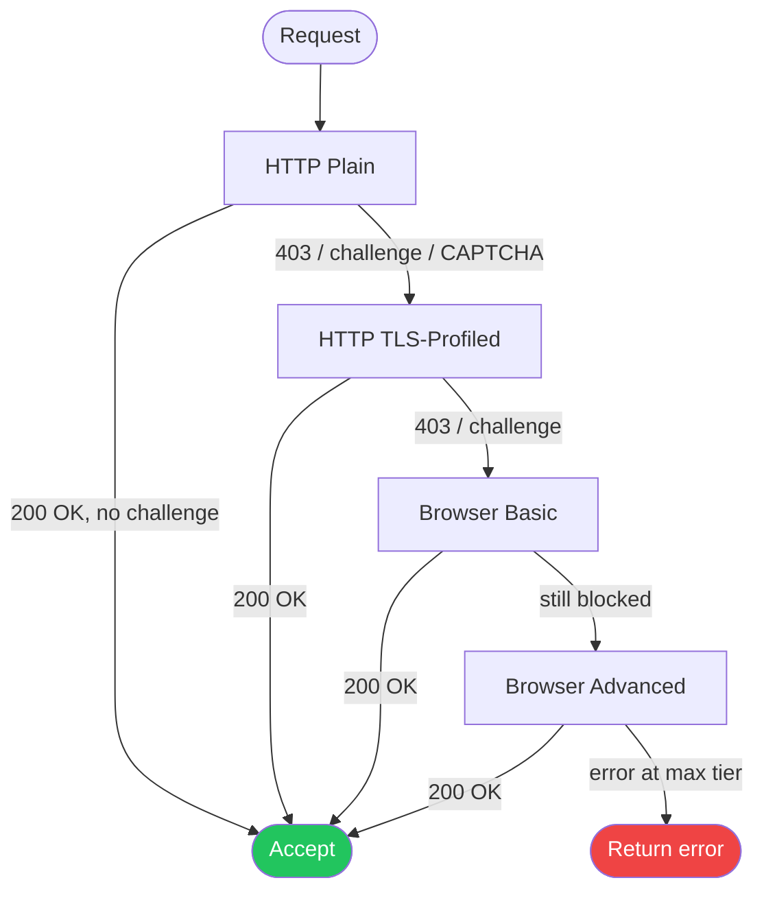

# Tiered Escalation Pipeline

Most sites can be scraped with a fast, lightweight HTTP client. A smaller percentage
require TLS fingerprint matching to pass network-layer checks. A still-smaller set
need a real browser to execute JavaScript and render the page. Running a full browser
for every request wastes CPU and memory.

*Tiered escalation* starts cheap and only pays the higher cost when the site
actively blocks the lighter approach. The pipeline tries tiers in order and
stops as soon as a satisfactory response is obtained.

---

## Escalation tiers

| Tier | Name | When to use |
| --- | --- | --- |
| 0 — `HttpPlain` | Standard HTTP | Most sites; lowest overhead |
| 1 — `HttpTlsProfiled` | HTTP + TLS fingerprint | Sites that JA3/JA4-fingerprint at the TCP layer |
| 2 — `BrowserBasic` | Headless Chrome, basic CDP stealth | JS-heavy sites without advanced anti-bot |
| 3 — `BrowserAdvanced` | Full stealth browser (all patches) | Cloudflare, DataDome, PerimeterX, Akamai |

Tiers are ordered — each higher tier is a strict superset of the previous one's capabilities and cost.

---

## The EscalationPolicy trait

```rust,no_run
use stygian_graph::ports::escalation::{EscalationPolicy, EscalationTier, ResponseContext};

pub trait EscalationPolicy: Send + Sync {
    /// The tier to attempt first.
    fn initial_tier(&self) -> EscalationTier;

    /// Given a response, decide whether to escalate or accept.
    /// Return `Some(next_tier)` to escalate, `None` to accept the response.
    fn should_escalate(
        &self,
        ctx: &ResponseContext,
        current: EscalationTier,
    ) -> Option<EscalationTier>;

    /// The highest tier this policy may reach.
    fn max_tier(&self) -> EscalationTier;
}
```

`ResponseContext` carries the signals the policy uses to decide:

| Field | Description |
| --- | --- |
| `status` | HTTP status code |
| `body_empty` | Response body is empty |
| `has_cloudflare_challenge` | Cloudflare, DataDome, or PerimeterX challenge detected |
| `has_captcha` | reCAPTCHA, hCaptcha, or Turnstile widget detected |

---

## DefaultEscalationPolicy

The built-in `DefaultEscalationPolicy` requires no custom trait implementation.
It combines automatic challenge detection with a per-domain learning cache.

### Challenge detection

`DefaultEscalationPolicy::context_from_body(status, body)` inspects the response
body for well-known markers from all major vendors:

| Vendor | Detected by |
| --- | --- |
| Cloudflare | `"Just a moment"`, `cf-browser-verification`, `__cf_bm` |
| DataDome | `"datadome"`, `dd_referrer` |
| PerimeterX | `_pxParam`, `_px.js`, `blockScript` |
| reCAPTCHA / hCaptcha / Turnstile | Script tag markers |

All anti-bot challenges map to `has_cloudflare_challenge: true`, which triggers
escalation on status 403, 429, or any challenge/CAPTCHA detected.

### Per-domain learning cache

When `EscalatingScrapingService` successfully reaches a domain at a tier above
`base_tier`, it records that tier in the policy's internal cache (TTL: 1 hour by default).
On the next request to the same domain the pipeline **skips the tiers it knows won't
work**, saving latency.

```rust,no_run
use std::time::Duration;
use stygian_graph::adapters::escalation::{DefaultEscalationPolicy, EscalationConfig};
use stygian_graph::ports::escalation::EscalationTier;

let policy = DefaultEscalationPolicy::new(EscalationConfig {
    // Allow escalation all the way to a full stealth browser.
    max_tier:  EscalationTier::BrowserAdvanced,
    // Start from plain HTTP on the first request to an unknown domain.
    base_tier: EscalationTier::HttpPlain,
    // Cache that "this domain needs BrowserBasic" for 30 minutes.
    cache_ttl: Duration::from_secs(1_800),
});
```

| Config field | Default | Description |
| --- | --- | --- |
| `max_tier` | `BrowserAdvanced` | Highest tier the policy may attempt |
| `base_tier` | `HttpPlain` | Starting tier for unknown domains |
| `cache_ttl` | 3 600 s (1 h) | How long domain-tier cache entries live |

---

## EscalatingScrapingService

`EscalatingScrapingService` implements the `ScrapingService` port and wires the
policy to a set of concrete service implementations.

```rust,no_run
use std::sync::Arc;
use stygian_graph::adapters::escalation::{
    DefaultEscalationPolicy, EscalationConfig, EscalatingScrapingService,
};
use stygian_graph::adapters::http::HttpAdapter;
use stygian_graph::ports::escalation::EscalationTier;

// 1. Build the policy.
let policy = DefaultEscalationPolicy::new(EscalationConfig::default());

// 2. Register a concrete service for each tier you want available.
let svc = EscalatingScrapingService::new(policy)
    .with_tier(EscalationTier::HttpPlain, Arc::new(HttpAdapter::new()))
    // Add HttpTlsProfiled and BrowserBasic/Advanced services here as needed.
    ;

// 3. Register in the pipeline's service registry.
// registry.register(Arc::new(svc));
```

If a tier has no service registered, the next available higher tier is used
automatically — you do not need to configure every tier.

### Metadata annotations

On success the service annotates the `ServiceOutput` metadata with two fields:

| Key | Example value |
| --- | --- |
| `escalation_tier` | `"browser_basic"` |
| `escalation_path` | `["http_plain","http_tls_profiled"]` |

These are useful for observability dashboards and for diagnosing why a particular
domain is consistently reaching higher tiers.

---

## Escalation flow



---

## Graph pipeline integration

Register the service as `"http_escalating"` in the pipeline config. All pipeline
nodes that specify `service = "http_escalating"` will use it:

```toml
# examples/escalation-pipeline.toml

[[services]]
name = "http_escalating"
kind = "http_escalating"

# Optional: set max escalation tier and cache TTL
[services.escalation]
max_tier  = "browser_advanced"   # default
base_tier = "http_plain"         # default
cache_ttl_secs = 1800

[[nodes]]
name    = "fetch-protected"
service = "http_escalating"
url     = "https://example.com/data"
```

---

## Custom EscalationPolicy

For specialised logic (status-code allow-lists, per-domain overrides, etc.) you can
implement `EscalationPolicy` directly:

```rust,no_run
use stygian_graph::ports::escalation::{EscalationPolicy, EscalationTier, ResponseContext};

struct AggressivePolicy;

impl EscalationPolicy for AggressivePolicy {
    fn initial_tier(&self) -> EscalationTier {
        // Always start from TLS-profiled HTTP — skip plain HTTP entirely.
        EscalationTier::HttpTlsProfiled
    }

    fn should_escalate(
        &self,
        ctx: &ResponseContext,
        current: EscalationTier,
    ) -> Option<EscalationTier> {
        // Escalate on any non-2xx response.
        if ctx.status < 200 || ctx.status >= 300 {
            current.next().filter(|&t| t <= self.max_tier())
        } else {
            None
        }
    }

    fn max_tier(&self) -> EscalationTier {
        EscalationTier::BrowserBasic
    }
}
```

---

## Detection landscape

Which escalation tier handles which detection vector:

| Detection vector | `HttpPlain` | `HttpTlsProfiled` | `BrowserBasic` | `BrowserAdvanced` |
| --- | :---: | :---: | :---: | :---: |
| IP reputation / rate limit | — | — | — | — |
| TLS fingerprint (JA3/JA4) | ✗ | ✓ | ✓ | ✓ |
| Missing JavaScript execution | ✗ | ✗ | ✓ | ✓ |
| `navigator.webdriver` flag | ✗ | ✗ | ✓ | ✓ |
| Canvas/WebGL fingerprint | ✗ | ✗ | ✗ | ✓ |
| CDP detection | ✗ | ✗ | partial | ✓ |
| Behavioural analysis | ✗ | ✗ | ✗ | ✓ |

IP reputation is orthogonal to tier — use sticky-session proxy rotation (see
[Sticky Sessions](../proxy/sticky-sessions.md)) in combination with escalation.
