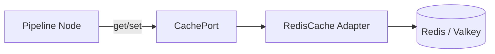
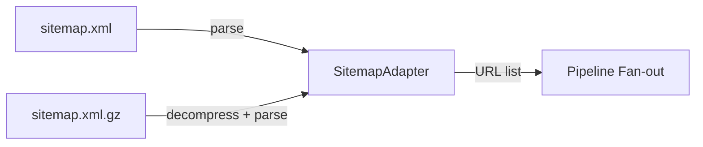
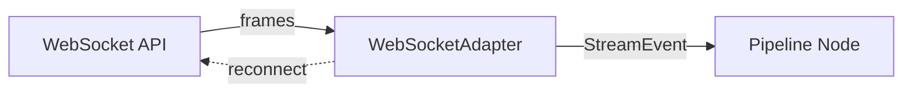
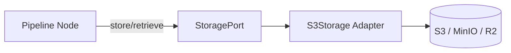
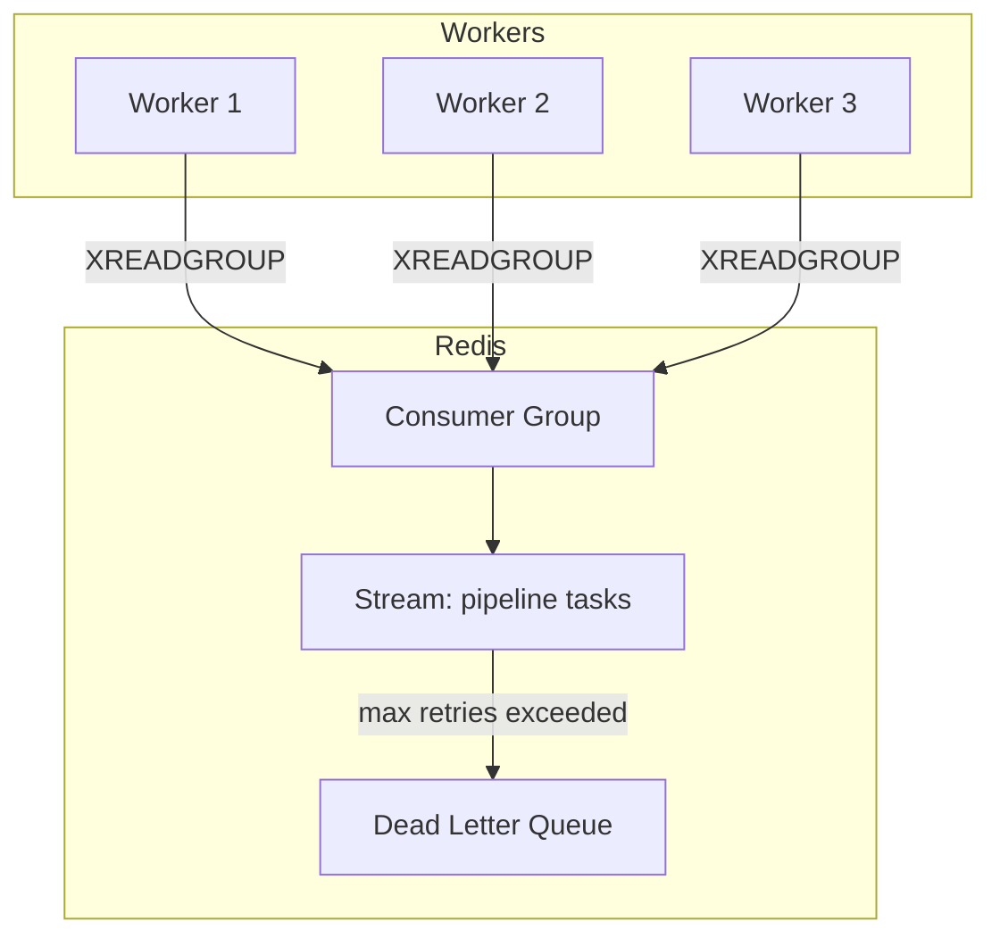
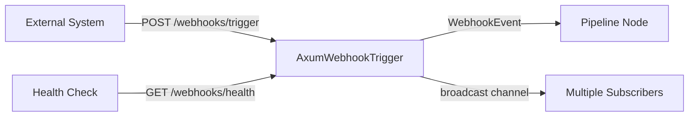
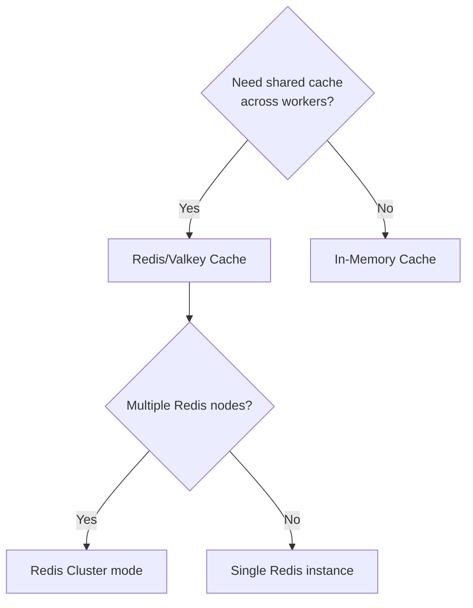

# Production Adapters

This chapter covers adapters added beyond the core set, filling production gaps
in caching, discovery, streaming, storage, distributed execution, and
event-driven triggers.

All adapters follow stygian's hexagonal architecture: each implements a port
trait and optionally `ScrapingService` for pipeline integration. Most are
feature-gated to keep the default build minimal.

---

## Feature Flags

| Feature flag | Crate dependency | Adapters enabled |
| --- | --- | --- |
| `redis` | `redis`, `deadpool-redis` | Redis/Valkey cache, Redis Streams work queue |
| `object-storage` | `rust-s3` | S3-compatible object storage |
| `api` | `axum`, `hmac`, `sha2` | Webhook trigger (HTTP listener) |
| `full` | all of the above | Everything |

Enable features in your `Cargo.toml`:

```toml
[dependencies]
stygian-graph = { version = "0.1", features = ["redis", "object-storage", "api"] }
# or enable everything:
stygian-graph = { version = "0.1", features = ["full"] }
```

---

## Redis/Valkey Cache

**Port**: `CachePort`
**Module**: `adapters::cache_redis`
**Feature**: `redis`
**Service name**: `"cache-redis"`

Production-grade distributed cache backed by Redis or Valkey. Uses connection
pooling via `deadpool-redis` for high-concurrency access.



### Configuration

| Parameter | Type | Default | Description |
| --- | --- | --- | --- |
| `url` | `String` | `"redis://127.0.0.1:6379"` | Redis connection URL |
| `prefix` | `String` | `"stygian"` | Key namespace prefix |
| `pool_size` | `usize` | `8` | Connection pool size |
| `default_ttl_secs` | `u64` | `3600` | Default TTL for cached entries |

### Operations

- **`get(key)`** → Fetch a cached value by key (with namespace prefix)
- **`set(key, value, ttl)`** → Store a value with TTL (uses `SETEX`)
- **`invalidate(key)`** → Delete a cached entry
- **`exists(key)`** → Check key existence without fetching the value

### Usage in pipeline TOML

```toml
[[services]]
name = "cache"
kind = "cache-redis"

[services.config]
url    = "redis://127.0.0.1:6379"
prefix = "myapp:cache"

[[nodes]]
name    = "fetch"
service = "http"
cache   = "cache"

[nodes.cache_config]
ttl_secs = 3600
```

---

## Sitemap / Sitemap Index Source

**Port**: `ScrapingService`
**Module**: `adapters::sitemap`
**Feature**: always available (no feature gate)
**Service name**: `"sitemap"`

Parses XML sitemaps (`<urlset>`) and sitemap index files (`<sitemapindex>`),
emitting discovered URLs as structured JSON for downstream pipeline nodes.



### Features

- Parses both `<urlset>` and `<sitemapindex>` root elements
- Recursive resolution of sitemap index entries
- Transparent decompression of `.xml.gz` sitemaps (via `flate2`)
- Extracts `<loc>`, `<lastmod>`, `<changefreq>`, `<priority>` per URL
- Date-range filtering via `lastmod_after` parameter

### `ServiceInput.params`

| Parameter | Type | Default | Description |
| --- | --- | --- | --- |
| `lastmod_after` | `String` (ISO 8601) | none | Only include URLs modified after this date |
| `max_depth` | `u32` | `3` | Max recursion depth for sitemap index |

### Output format

```json
{
  "data": [
    {
      "loc": "https://example.com/page",
      "lastmod": "2025-06-01",
      "changefreq": "weekly",
      "priority": 0.8
    }
  ],
  "metadata": {
    "source": "sitemap",
    "url_count": 42,
    "format": "urlset"
  }
}
```

---

## RSS / Atom Feed Source

**Port**: `ScrapingService`
**Module**: `adapters::rss_feed`
**Feature**: always available (no feature gate)
**Service name**: `"rss-feed"`

Parses RSS 1.0, RSS 2.0, and Atom feeds using the `feed-rs` crate, emitting
feed items as structured JSON with feed-level metadata.

### `ServiceInput.params`

| Parameter | Type | Default | Description |
| --- | --- | --- | --- |
| `since` | `String` | none | Only include entries newer than this (ISO 8601 or duration like `"24h"`) |
| `limit` | `u32` | none | Maximum number of items to return |
| `categories` | `Array<String>` | none | Filter to items matching these categories |

### Output format

```json
{
  "data": [
    {
      "title": "Article Title",
      "link": "https://example.com/article",
      "published": "2025-06-15T10:00:00Z",
      "summary": "Article summary...",
      "categories": ["tech", "rust"],
      "authors": ["Author Name"]
    }
  ],
  "metadata": {
    "feed_title": "Example Feed",
    "feed_description": "Latest articles",
    "last_updated": "2025-06-15T12:00:00Z"
  }
}
```

---

## WebSocket Stream Source

**Port**: `StreamSourcePort`
**Module**: `adapters::websocket`
**Feature**: always available (no feature gate)
**Service name**: `"websocket"`

Real-time data ingestion from WebSocket APIs using `tokio-tungstenite`. Supports
text and binary frames, optional subscribe messages, and automatic reconnection.



### `ServiceInput.params`

| Parameter | Type | Default | Description |
| --- | --- | --- | --- |
| `max_messages` | `u32` | `100` | Stop after collecting N messages |
| `timeout_secs` | `u64` | `60` | Max seconds to wait for messages |
| `subscribe_message` | `String` | none | JSON message sent on connect (e.g. channel subscription) |
| `ping_interval_secs` | `u64` | `30` | WebSocket ping keepalive interval |

---

## CSV / TSV Data Source

**Port**: `DataSourcePort`, `ScrapingService`
**Module**: `adapters::csv_source`
**Feature**: always available (no feature gate)
**Service name**: `"csv"`

Reads CSV and TSV files from local paths or HTTP URLs, outputting rows as
structured JSON. Supports automatic delimiter detection, configurable headers,
and row pagination.

### `ServiceInput.params`

| Parameter | Type | Default | Description |
| --- | --- | --- | --- |
| `delimiter` | `String` | auto-detect | Column delimiter (`,`, `\t`, `;`, `\|`) |
| `has_header` | `bool` | `true` | Whether the first row is a header |
| `skip_rows` | `u32` | `0` | Skip N rows before the header |
| `max_rows` | `u32` | none | Limit number of rows processed |
| `encoding` | `String` | auto-detect | Force character encoding |

---

## S3-Compatible Object Storage

**Port**: `StoragePort`, `ScrapingService`
**Module**: `adapters::storage_s3`
**Feature**: `object-storage`
**Service name**: `"storage-s3"`

Stores and retrieves pipeline data in any S3-compatible object storage (AWS S3,
MinIO, Cloudflare R2, DigitalOcean Spaces).



### Configuration

| Parameter | Type | Default | Description |
| --- | --- | --- | --- |
| `bucket` | `String` | required | S3 bucket name |
| `region` | `String` | `"us-east-1"` | AWS region or compatible region string |
| `endpoint` | `String` | none | Custom endpoint URL (required for MinIO, R2) |
| `prefix` | `String` | `""` | Key prefix for all stored objects |
| `path_style` | `bool` | `false` | Use path-style URLs (required for MinIO) |
| `access_key` | `String` | env var | S3 access key (or `AWS_ACCESS_KEY_ID` env) |
| `secret_key` | `String` | env var | S3 secret key (or `AWS_SECRET_ACCESS_KEY` env) |

### Key structure

```
{prefix}/{pipeline_id}/{node_name}/{record_id}.json   ← data objects
{prefix}/_index/{id}                                    ← index for O(1) lookups
```

### ScrapingService actions

| `params.action` | Description |
| --- | --- |
| `"store"` | Store upstream data as a JSON object |
| `"get"` | Retrieve a specific object by ID |
| `"list"` | List objects under a pipeline prefix |

Objects larger than 5 MiB use multipart upload automatically.

---

## Redis Streams Work Queue

**Port**: `WorkQueuePort`
**Module**: `adapters::distributed_redis`
**Feature**: `redis`
**Service name**: `"distributed-redis"`

Distributed task queue using Redis Streams for reliable, horizontally-scaled
pipeline execution. Supports consumer groups, dead-letter queues, and stuck
task reclamation.



### Configuration

| Parameter | Type | Default | Description |
| --- | --- | --- | --- |
| `url` | `String` | `"redis://127.0.0.1:6379"` | Redis connection URL |
| `stream_name` | `String` | `"stygian:work"` | Redis stream key |
| `consumer_group` | `String` | `"workers"` | Consumer group name |
| `max_retries` | `u32` | `3` | Max retries before dead-letter |
| `claim_timeout_ms` | `u64` | `30000` | Reclaim stuck tasks after this duration |
| `pool_size` | `usize` | `4` | Connection pool size |

### Operations

- **Enqueue**: `XADD` with task payload; task metadata stored in `{stream}:tasks:{id}`
- **Dequeue**: `XREADGROUP` with consumer group (competing-consumer pattern)
- **Acknowledge**: `XACK` + metadata update on success; retry counter on failure
- **Dead-letter**: After `max_retries`, task moved to `{stream}:dlq`
- **Reclaim**: `XCLAIM` for tasks idle longer than `claim_timeout_ms`

Consumer names are `{hostname}:{pid}` for traceability.

---

## Webhook Trigger

**Port**: `WebhookTrigger`, `ScrapingService`
**Module**: `adapters::webhook`
**Feature**: `api`
**Service name**: `"webhook-trigger"`

Axum-based HTTP listener for event-driven pipeline execution. Accepts inbound
webhook POST requests, verifies HMAC-SHA256 signatures, and emits events to
the pipeline.



### Configuration

| Parameter | Type | Default | Description |
| --- | --- | --- | --- |
| `bind_address` | `String` | `"127.0.0.1:3001"` | Address to bind the HTTP listener |
| `path_prefix` | `String` | `"/webhooks"` | URL path prefix for routes |
| `secret` | `String` | none | HMAC-SHA256 secret for signature verification |
| `max_body_size` | `usize` | `1048576` (1 MiB) | Maximum request body size |

### Endpoints

| Method | Path | Description |
| --- | --- | --- |
| `POST` | `/{prefix}/trigger` | Accept webhook payload |
| `GET` | `/{prefix}/health` | Health check (returns 200 OK) |

### Signature verification

When `secret` is configured, the adapter requires an `X-Hub-Signature-256`
header (GitHub-compatible format):

```
X-Hub-Signature-256: sha256=<hex-encoded-hmac>
```

Requests without a valid signature receive `401 Unauthorized`.

### ScrapingService params

| Parameter | Type | Default | Description |
| --- | --- | --- | --- |
| `path_prefix` | `String` | `"/webhooks"` | URL path prefix |
| `secret` | `String` | none | HMAC secret |
| `timeout_secs` | `u64` | `60` | Max seconds to wait for an event |

---

## Choosing the Right Backend

### Cache backends



| Backend | Best for | Persistence | Shared |
| --- | --- | --- | --- |
| In-memory | Development, single-worker | No | No |
| Redis/Valkey | Production, multi-worker | Optional (AOF/RDB) | Yes |

### Storage backends

| Backend | Best for | Cloud-native | Feature flag |
| --- | --- | --- | --- |
| File system | Development, local runs | No | none |
| PostgreSQL | Transactional workloads | Partial | `postgres` |
| S3-compatible | Cloud production, large objects | Yes | `object-storage` |

### Work queue backends

| Backend | Best for | Distributed | Feature flag |
| --- | --- | --- | --- |
| Local queue | Development, single-process | No | none |
| Redis Streams | Production, multi-worker | Yes | `redis` |
