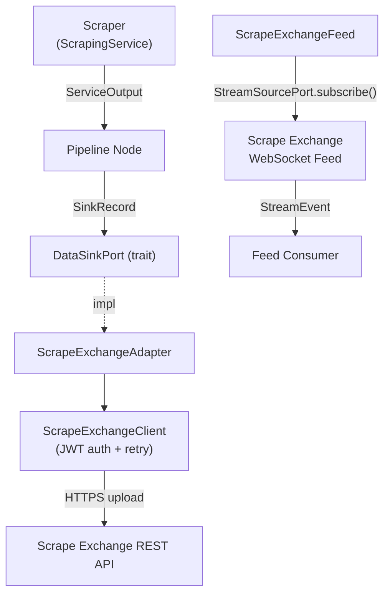

# Scrape Exchange Integration

[Scrape Exchange](https://scrape.exchange) is a platform for sharing and
monetising scraped datasets. Stygian's `scrape-exchange` feature provides:

- A **REST API client** ([`ScrapeExchangeClient`]) for uploading and querying data.
- A **`DataSinkPort` adapter** ([`ScrapeExchangeAdapter`]) for publishing records from pipelines.
- A **WebSocket feed adapter** ([`ScrapeExchangeFeed`]) for receiving real-time upload notifications.

---

## Feature Flag

```toml
[dependencies]
stygian-graph = { version = "*", features = ["scrape-exchange"] }
```

---

## Authentication

Scrape Exchange uses short-lived JWTs derived from an API key pair. The client
handles token acquisition and automatic refresh transparently.

**Required environment variables** (used by `ScrapeExchangeConfig::from_env()`):

| Variable | Description |
| --- | --- |
| `SCRAPE_EXCHANGE_KEY_ID` | API key ID |
| `SCRAPE_EXCHANGE_KEY_SECRET` | API key secret |
| `SCRAPE_EXCHANGE_BASE_URL` | API base URL (default: `https://scrape.exchange/api/`) |

Alternatively, build the config directly:

```rust
use stygian_graph::adapters::scrape_exchange::ScrapeExchangeConfig;

let config = ScrapeExchangeConfig {
    api_key_id: "my-key-id".to_string(),
    api_key_secret: "my-secret".to_string(),
    base_url: "https://scrape.exchange/api/".to_string(),
};
```

---

## REST Client (`ScrapeExchangeClient`)

The low-level client exposes the full API surface:

| Method | Description |
| --- | --- |
| `upload(payload)` | Upload a scraped record as JSON |
| `query(uploader, platform, entity)` | List published records |
| `item_lookup(id)` | Fetch a single record by ID |
| `health_check()` | Verify the API is reachable |

```rust
use stygian_graph::adapters::scrape_exchange::{ScrapeExchangeClient, ScrapeExchangeConfig};
use serde_json::json;

# tokio::runtime::Runtime::new().unwrap().block_on(async {
let config = ScrapeExchangeConfig::from_env()?;
let client = ScrapeExchangeClient::new(config).await?;

let result = client.upload(json!({
    "schema_id": "product-v1",
    "source": "https://shop.example.com/items/42",
    "content": { "sku": "ABC-42", "price": 9.99 },
})).await?;

println!("Uploaded: {}", result["id"]);
# Ok::<(), Box<dyn std::error::Error>>(())
# });
```

---

## DataSinkPort Adapter (`ScrapeExchangeAdapter`)

`ScrapeExchangeAdapter` implements [`DataSinkPort`](./data-sinks.md), enabling
pipelines to publish scraped records without knowing the destination backend.

### Schema Validation

Records are validated locally before upload:

- `data` must not be `null` when `schema_id` is set.
- `data` objects must not be empty.
- Full schema enforcement is performed server-side by Scrape Exchange.

### Field Mapping

| `SinkRecord` field | Scrape Exchange API field |
| --- | --- |
| `schema_id` | `schema_id` |
| `source_url` | `source` |
| `data` | `content` |
| `metadata` | `metadata` |

### Usage

```rust
use stygian_graph::adapters::scrape_exchange::{ScrapeExchangeAdapter, ScrapeExchangeConfig};
use stygian_graph::ports::data_sink::{DataSinkPort, SinkRecord};
use serde_json::json;

# tokio::runtime::Runtime::new().unwrap().block_on(async {
let config = ScrapeExchangeConfig::from_env()?;
let adapter = ScrapeExchangeAdapter::new(config).await?;

let record = SinkRecord::new(
    "product-v1",
    "https://shop.example.com/items/42",
    json!({ "sku": "ABC-42", "price": 9.99 }),
).with_meta("run_id", "run-2026-04-10");

let receipt = adapter.publish(&record).await?;
println!("Published: {} at {}", receipt.id, receipt.published_at);
# Ok::<(), Box<dyn std::error::Error>>(())
# });
```

### Error Handling

| Error variant | HTTP status | Meaning |
| --- | --- | --- |
| `DataSinkError::ValidationFailed` | — | Local validation rejected |
| `DataSinkError::RateLimited` | 429 | Back off and retry |
| `DataSinkError::Unauthorized` | 401 / 403 | Check credentials |
| `DataSinkError::PublishFailed` | other | API or network error |

---

## WebSocket Real-Time Feed (`ScrapeExchangeFeed`)

Subscribe to live upload notifications via the `/api/messages/v1` WebSocket
endpoint. The feed adapter implements [`StreamSourcePort`].

### Filter Options

Server-side filters reduce bandwidth; client-side filters (`schema_owner`,
`schema_version`) are applied in-process:

```rust
use stygian_graph::adapters::scrape_exchange::{FeedFilter, FeedConfig};

let config = FeedConfig {
    filter: FeedFilter {
        platform: Some("web".to_string()),
        entity: Some("products".to_string()),
        schema_owner: Some("alice".to_string()),
        ..Default::default()
    },
    max_reconnect_attempts: 5,
    initial_backoff_ms: 500,
    ..Default::default()
};
```

### Reconnection

`ScrapeExchangeFeed` reconnects automatically on WebSocket disconnect using
exponential backoff starting at `initial_backoff_ms`, doubling each attempt,
and capped at 30 seconds.

### Usage

```rust
use stygian_graph::adapters::scrape_exchange::{ScrapeExchangeFeed, FeedConfig};
use stygian_graph::ports::stream_source::StreamSourcePort;

# tokio::runtime::Runtime::new().unwrap().block_on(async {
let feed = ScrapeExchangeFeed::new(FeedConfig::default());
let events = feed
    .subscribe("wss://scrape.exchange/api/messages/v1", Some(100))
    .await?;

for event in &events {
    println!("New upload: {}", event.data);
}
# Ok::<(), Box<dyn std::error::Error>>(())
# });
```

### Authenticated Feed

Use `with_bearer_token()` to connect to authenticated endpoints (obtain the
JWT from `ScrapeExchangeClient::get_token()` first):

```rust
use stygian_graph::adapters::scrape_exchange::{
    ScrapeExchangeFeed, ScrapeExchangeClient, ScrapeExchangeConfig, FeedConfig,
};
use stygian_graph::ports::stream_source::StreamSourcePort;

# tokio::runtime::Runtime::new().unwrap().block_on(async {
let config = ScrapeExchangeConfig::from_env()?;
let client = ScrapeExchangeClient::new(config).await?;
let token = client.get_token().await?;

let feed = ScrapeExchangeFeed::new(FeedConfig::default())
    .with_bearer_token(token);

let events = feed
    .subscribe("wss://scrape.exchange/api/messages/v1", Some(50))
    .await?;
# Ok::<(), Box<dyn std::error::Error>>(())
# });
```

---

## JSON Schema Registration

Before uploading records with a given `schema_id`, that schema must be
registered on the Scrape Exchange platform. Stygian does not manage schema
registration — use the [Scrape Exchange Python tools](https://github.com/ScrapeExchange/scrape-python)
or the web dashboard.

The `schema_id` in a `SinkRecord` must exactly match the registered schema
name, including version suffix (e.g. `"product-v1"`).

---

## Architecture Overview


