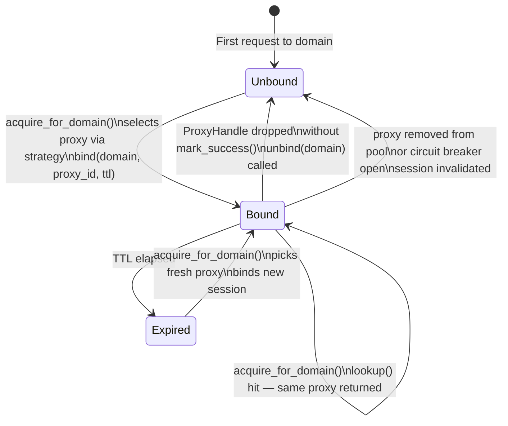

# Sticky Sessions

Without session stickiness, every proxy-rotation call may select a different exit IP.
Most sites treat the IP as part of the session identity. A login flow that acquires a
cookie from IP A and then submits the form from IP B will fail — or worse, trigger a
suspicious-behaviour alarm.

*Sticky sessions* bind a target domain to one proxy for a configurable duration, so
all requests to the same site use the same exit IP for the lifetime of the binding.
When the binding expires the next request automatically picks a fresh proxy and pins
the new one.

---

## Configuration

Sticky-session behaviour is controlled by `ProxyConfig::sticky_policy`:

```rust,no_run
use std::time::Duration;
use stygian_proxy::{ProxyConfig, session::StickyPolicy};

let config = ProxyConfig {
    sticky_policy: StickyPolicy::domain(Duration::from_secs(600)), // 10-minute sessions
    ..ProxyConfig::default()
};
```

| Policy variant | Description |
| --- | --- |
| `StickyPolicy::Disabled` (default) | No binding — every call may use a different proxy |
| `StickyPolicy::Domain { ttl }` | Bind per domain name; TTL controls how long the binding lives |

The default TTL for `StickyPolicy::domain_default()` is **5 minutes**.

---

## Using sticky sessions

Once the policy is set, use `acquire_for_domain` instead of `acquire_proxy`:

```rust,no_run
use std::{sync::Arc, time::Duration};
use stygian_proxy::{
    ProxyConfig, ProxyManager, ProxyType, Proxy,
    session::StickyPolicy,
    storage::MemoryProxyStore,
};

let storage = Arc::new(MemoryProxyStore::default());
let config  = ProxyConfig {
    sticky_policy: StickyPolicy::domain(Duration::from_secs(600)),
    ..ProxyConfig::default()
};
let mgr = ProxyManager::with_round_robin(storage, config)?;

// Add proxies to the pool …
mgr.add_proxy(Proxy {
    url:        "http://residential-proxy:8080".into(),
    proxy_type: ProxyType::Http,
    username:   Some("user".into()),
    password:   Some("pass".into()),
    weight:     1,
    tags:       vec!["residential".into()],
}).await?;

// ── Login flow ────────────────────────────────────────────────────────────────

// All three calls reuse the same proxy for "store.example.com"
// as long as the 10-minute TTL has not elapsed.

let handle = mgr.acquire_for_domain("store.example.com").await?;
let _ = client_with_proxy(&handle).get("https://store.example.com/login").send().await?;
handle.mark_success();

let handle = mgr.acquire_for_domain("store.example.com").await?;
let _ = client_with_proxy(&handle)
    .post("https://store.example.com/session")
    .form(&[("user", "alice"), ("pass", "hunter2")])
    .send()
    .await?;
handle.mark_success();

let handle = mgr.acquire_for_domain("store.example.com").await?;
let _ = client_with_proxy(&handle).get("https://store.example.com/account").send().await?;
handle.mark_success();
# Ok(())
```

---

## Session lifecycle



---

## Failure handling

`ProxyHandle` is a RAII guard. When it is dropped without calling `mark_success()`,
the sticky session for that domain is **automatically invalidated** and the circuit
breaker records a failure:

```rust,no_run
let handle = mgr.acquire_for_domain("shop.example.com").await?;

// If the request fails or the guard is dropped without mark_success(),
// the domain session is cleared and the circuit breaker is incremented.
// The next call to acquire_for_domain picks a fresh proxy.
let resp = client.get("https://shop.example.com/checkout").send().await?;

if resp.status().is_success() {
    handle.mark_success();  // binding stays alive for the remainder of the TTL
}
// else: drop without mark_success → session reset automatically
```

---

## Low-level SessionMap API

`SessionMap` can also be used standalone, outside of `ProxyManager`, when you need
fine-grained control:

```rust,no_run
use std::time::Duration;
use uuid::Uuid;
use stygian_proxy::session::SessionMap;

let sessions = SessionMap::new();
let proxy_id = Uuid::new_v4();

// Bind "login.example.com" to a proxy for 5 minutes.
sessions.bind("login.example.com", proxy_id, Duration::from_secs(300));

// Lookup returns Some(id) while the session is active.
assert_eq!(sessions.lookup("login.example.com"), Some(proxy_id));

// Purge all expired entries — safe to call on any schedule.
let removed = sessions.purge_expired();
println!("purged {removed} expired sessions");

// Manually invalidate a binding.
sessions.unbind("login.example.com");
```

| Method | Description |
| --- | --- |
| `bind(domain, proxy_id, ttl)` | Create or overwrite a domain binding |
| `lookup(domain) -> Option<Uuid>` | Return the bound proxy ID, or `None` if expired |
| `unbind(domain)` | Remove a binding immediately |
| `purge_expired() -> usize` | Evict all expired bindings; returns count removed |
| `active_count() -> usize` | Number of non-expired bindings currently held |

---

## Pool stats

`ProxyManager::pool_stats()` includes sticky session state:

```rust,no_run
let stats = mgr.pool_stats().await?;
println!("total proxies:    {}", stats.total);
println!("healthy proxies:  {}", stats.healthy);
println!("circuit open:     {}", stats.open);
println!("active sessions:  {}", stats.active_sessions);
```

---

## Multi-domain scraping

When you scrape many domains concurrently, each gets its own independent binding.
The `ProxyManager` session map is an `Arc<RwLock<HashMap<String, ...>>>` so concurrent
lookups never block each other:

```rust,no_run
// Different domains → different proxies, each bound separately.
let h1 = mgr.acquire_for_domain("shop-a.com").await?;
let h2 = mgr.acquire_for_domain("shop-b.com").await?;
let h3 = mgr.acquire_for_domain("shop-c.com").await?;

// All three run in parallel — each gets its own sticky proxy.
tokio::join!(
    fetch(&h1, "https://shop-a.com/products"),
    fetch(&h2, "https://shop-b.com/products"),
    fetch(&h3, "https://shop-c.com/products"),
);
```
