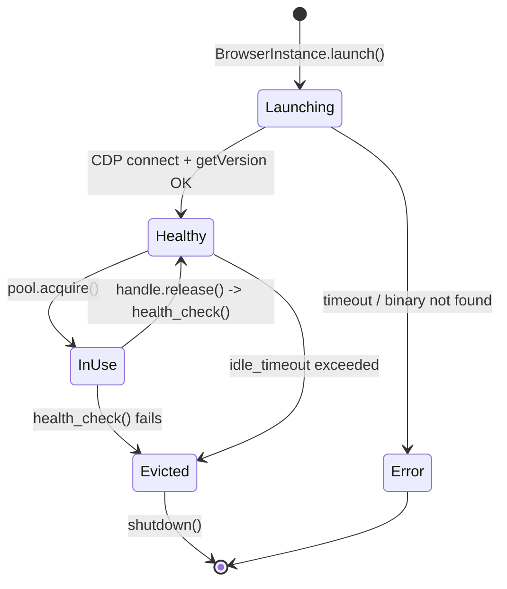
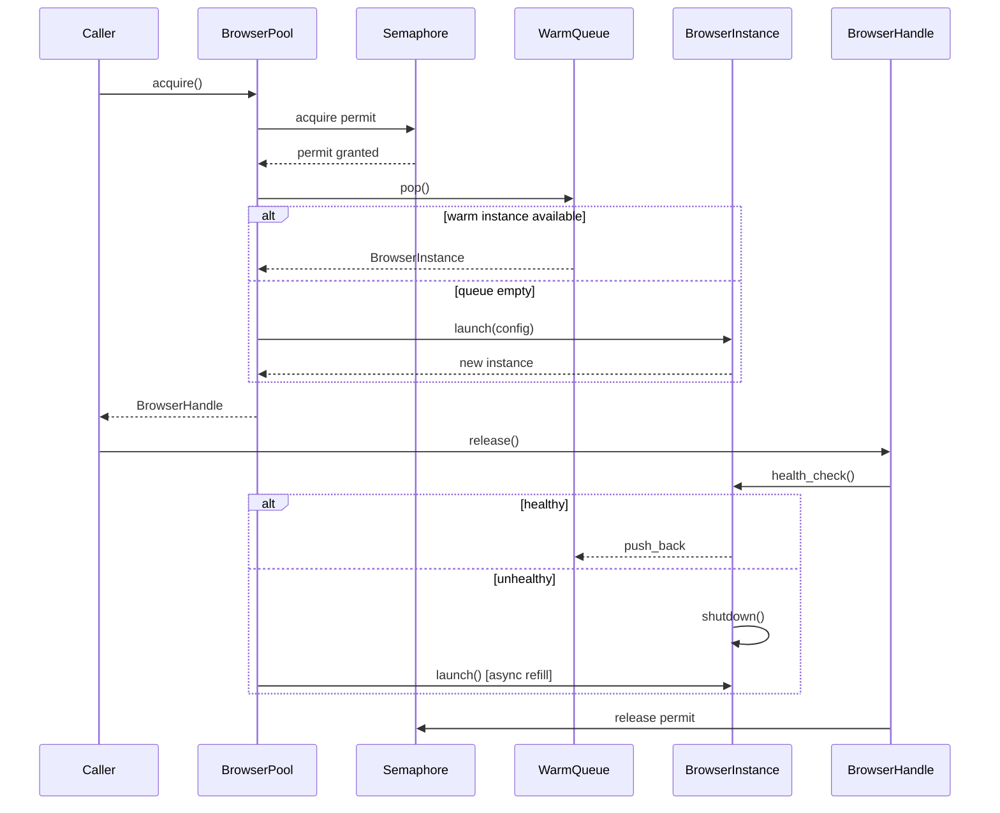
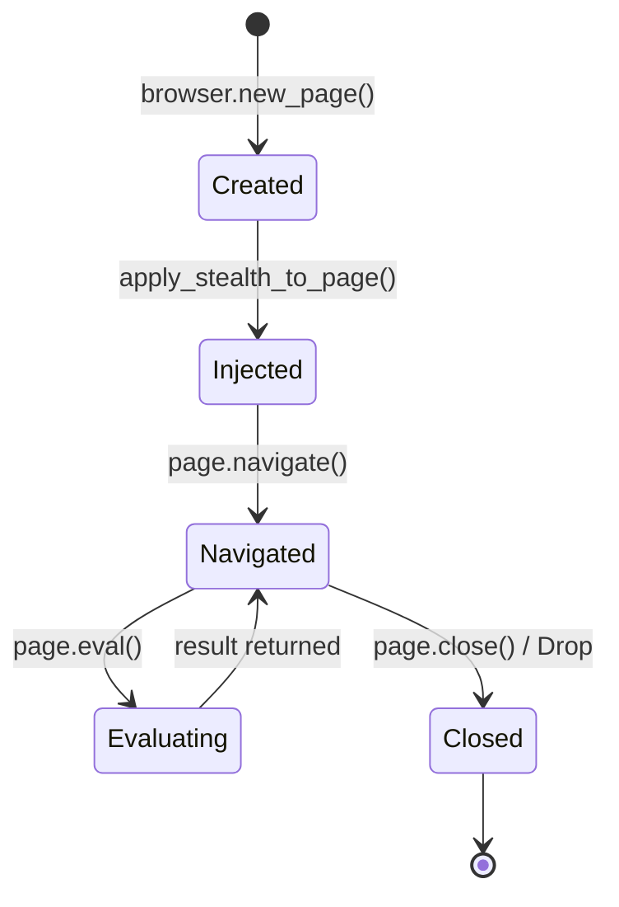
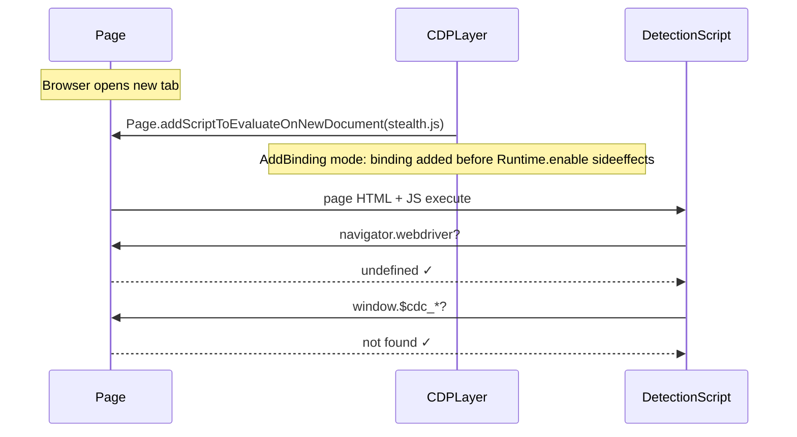

# stygian-browser — Architecture & Design

## Overview

`stygian-browser` is a **modular** Rust library for high-performance, anti-detection browser
automation.  It wraps the Chrome DevTools Protocol (CDP) — exposed by
[`chromiumoxide`](https://github.com/mattsse/chromiumoxide) — with ergonomic pooling, stealth
injection, and behavioral mimicry layers.

```text
┌────────────────────────────────────────────────────────────┐
│                    Application / User Code                 │
└──────────────────────┬─────────────────────────────────────┘
                       │  BrowserPool::new / acquire
┌──────────────────────▼─────────────────────────────────────┐
│                   pool.rs — BrowserPool                    │
│   warm queue · Semaphore backpressure · health eviction    │
└──────────────────────┬─────────────────────────────────────┘
                       │  BrowserInstance::launch
┌──────────────────────▼────────────────────────────────────┐
│                browser.rs — BrowserInstance               │
│   chromiumoxide::Browser + health + lifecycle             │
└──────────┬────────────────────────────┬───────────────────┘
           │ new_page()                 │ apply_stealth_to_page()
┌──────────▼───────────┐    ┌───────────▼─────────────────────┐
│ page.rs — PageHandle │    │  stealth.rs — StealthProfile    │
│ navigate · eval      │    │  fingerprint.rs — Fingerprint   │
│ screenshot · cookies │    │  behavior.rs — MouseSimulator   │
│ resource filter      │    │  webrtc.rs — WebRtcConfig       │
└──────────────────────┘    │  cdp_protection.rs — CdpProtect │
                            └─────────────────────────────────┘
```

---

## Module Responsibilities

| Module | Role |
| -------- | ------ |
| `browser.rs` | Owns one `chromiumoxide::Browser` process handle.  Manages launch args, health checks, and graceful shutdown. |
| `pool.rs` | Maintains a warm queue of `BrowserInstance`s. Enforces max concurrency with a `tokio::sync::Semaphore`.  Evicts and replaces unhealthy instances. |
| `page.rs` | Wraps `chromiumoxide::Page` with timeout-guarded operations: `navigate`, `eval`, `content`, `screenshot`, `save_cookies`, resource filtering. |
| `config.rs` | `BrowserConfig` + `BrowserConfigBuilder`.  Reads environment variable overrides at construction time. |
| `stealth.rs` | Builds and injects the navigator-spoof + WebGL + canvas-noise JavaScript via CDP `Page.addScriptToEvaluateOnNewDocument`. |
| `fingerprint.rs` | Generates `Fingerprint` structs with device-profile-weighted random values.  Drives stealth script values. |
| `behavior.rs` | `MouseSimulator` (Bézier paths), `TypingSimulator` (WPM with typos), `InteractionSimulator` (scroll/hover). |
| `webrtc.rs` | Produces Chrome command-line flags and a JS injection that enforces the chosen `WebRtcPolicy`. |
| `cdp_protection.rs` | Three modes for hiding CDP protocol artifacts (`AddBinding`, `IsolatedWorld`, `EnableDisable`). |
| `error.rs` | All error variants via `thiserror`.  Every variant carries structured fields (no string blobs). |

---

## CDP Protocol Primer

Chrome DevTools Protocol is a JSON-RPC-over-WebSocket API that `chromiumoxide` exposes
as typed Rust structs.  The protocol has three domains relevant here:

```text
Browser.getVersion           ← health check
Page.addScriptToEvaluate...  ← stealth injection (runs before any page JS)
Runtime.evaluate             ← eval / exec JS in page context
Network.getCookies           ← session save
Page.captureScreenshot       ← screenshot
Fetch.enable / continueReq   ← resource filtering
```

`chromiumoxide` spawns Chrome as a child process with `--remote-debugging-port=0`
and connects via WebSocket to the allocated port.  Each `Page` object corresponds
to a CDP Target (tab).

---

## Browser Lifecycle



1. **Launch** — Chrome is spawned with anti-detection args; `chromiumoxide` connects
   and performs a `Browser.getVersion` handshake.
2. **Warm queue** — After launch the instance sits in `warm: VecDeque<BrowserInstance>`
   inside the pool.  Subsequent `acquire()` calls dequeue immediately (~0 ms).
3. **Acquire** — The Semaphore permit is taken first (backpressure).  An instance is
   popped from the warm queue or launched fresh if the queue is empty.
4. **Release** — The handle is returned; the instance's health is re-checked.  If
   it passes, it goes back to the warm queue.  If it fails, it is shut down and a
   fresh instance is launched asynchronously to refill the pool.
5. **Eviction** — An LRU sweep checks `uptime()` against `idle_timeout`.  Instances
   older than the threshold are replaced proactively.

---

## Anti-Detection Architecture

### Layer 1 — Launch Arguments

Chrome is launched with flags that disable automation-specific behaviour before any
JavaScript runs:

```text
--disable-blink-features=AutomationControlled
--no-first-run
--no-default-browser-check
--disable-extensions-except=...
...
```

These prevent the browser from advertising its automated state via IDL attributes
or version strings.

### Layer 2 — CDP Leak Protection (`cdp_protection.rs`)

Three modes handle the fact that `Runtime.enable` (called internally by `chromiumoxide`)
leaves a detectable fingerprint in the JS execution context:

| Mode | Mechanism |
| ------ | ----------- |
| `AddBinding` | Adds a global binding before scripts execute; the `$cdc_*` property never materialises. |
| `IsolatedWorld` | Runs injection in a separate execution context so content scripts cannot see CDP globals. |
| `EnableDisable` | Toggles `Runtime.enable`/`Runtime.disable` around each command to minimise exposure. |

### Layer 3 — Page Script Injection (`stealth.rs`, `fingerprint.rs`)

`Page.addScriptToEvaluateOnNewDocument` runs our injection **before** any page JavaScript.
The script:

1. Redefines `navigator.webdriver` to `undefined` via `Object.defineProperty`
2. Populates `navigator.plugins` with a synthetic `PluginArray`
3. Sets `navigator.hardwareConcurrency`, `navigator.deviceMemory`, `navigator.platform`
4. Overrides `HTMLCanvasElement.prototype.toDataURL` and `CanvasRenderingContext2D.prototype.getImageData`
   to add imperceptible sub-pixel noise (unique per load)
5. Patches `WebGLRenderingContext.prototype.getParameter` to return the spoofed GPU

All values are drawn from a `Fingerprint` struct generated by `fingerprint.rs` using
weighted random selection over real device profiles (Windows Chrome, macOS Chrome, etc.).

### Layer 4 — Behavioral Mimicry (`behavior.rs`)

Active only at `StealthLevel::Advanced`.  Applied when calling
`apply_stealth_to_page`.

**Mouse paths** — `MouseSimulator` generates cubic Bézier curves between (x₀,y₀)
and (x₁,y₁).  Step count scales linearly with Euclidean distance (12–120 steps).
Control points are offset perpendicular to the straight path, creating a natural arc.
Micro-tremor (±0.3 px) is added per step.

**Typing** — `TypingSimulator` models per-key delays drawn from a configurable WPM
distribution (70–130 WPM base).  With a non-zero `error_rate`, typos are inserted and
immediately corrected with Backspace, as humans do.

---

## Browser Pool Flow



---

## Page Lifecycle



---

## CDP Leak Protection Sequence



---

## Performance Characteristics

| Metric | Target | Notes |
| -------- | -------- | ------- |
| Warm pool acquire | < 100 ms | Semaphore + VecDeque pop; zero I/O |
| Cold start (launch) | < 2 s | Chrome spawn + WS handshake |
| Stealth injection | < 5 ms | addScriptToEvaluateOnNewDocument |
| Navigation (median) | 1–3 s | Network-dependent |
| Screenshot (full page) | 100–500 ms | Depends on page complexity |
| Memory per browser | 80–200 MB | Headless Chrome baseline |

---

## Security Considerations

- `BrowserConfig` is validated via `validate()` before use; invalid configs return
  structured error lists rather than panicking.
- Proxy credentials are passed as command-line arguments to Chrome (not logged).
- `user_data_dir` is distinct per browser instance in tests to prevent `SingletonLock`
  contention; production callers should similarly isolate profiles.
- `eval()` executes arbitrary JS in the page context — callers are responsible for
  ensuring script content comes from trusted sources.

---

## Adding a New Stealth Technique

1. Add the JS injection logic to `stealth.rs::StealthProfile::injection_script()`.
2. If the technique needs a runtime-generated value (e.g., a random canvas seed),
   add the field to `Fingerprint` in `fingerprint.rs` with a suitable distribution.
3. Thread the value through `apply_stealth_to_page` in `stealth.rs`.
4. Gate the technique on `StealthConfig` fields so it can be toggled per call site.
5. Add a unit test in `stealth.rs` confirming the script contains the expected tokens.
6. Add a detection test in `tests/detection.rs` confirming the property is hidden
   after injection.

---

## Dependency Rationale

| Crate | Version | Why |
| ------- | --------- | ----- |
| `chromiumoxide` | 0.7 | Typed CDP bindings + Chrome process management |
| `tokio` | 1.49 | Async runtime for all I/O |
| `thiserror` | 1 | Ergonomic error types without `anyhow` bleed |
| `serde` / `serde_json` | 1 | Config serialisation + JS eval return value deserialisation |
| `tracing` | 0.1 | Structured spans for pool events |
| `parking_lot` | 0.12 | Fair `RwLock` without Tokio overhead for sync config reads |
| `ulid` | 1.2 | Sortable correlation IDs for browser instances |
| `futures` | 0.3 | `StreamExt` for CDP event streams |
